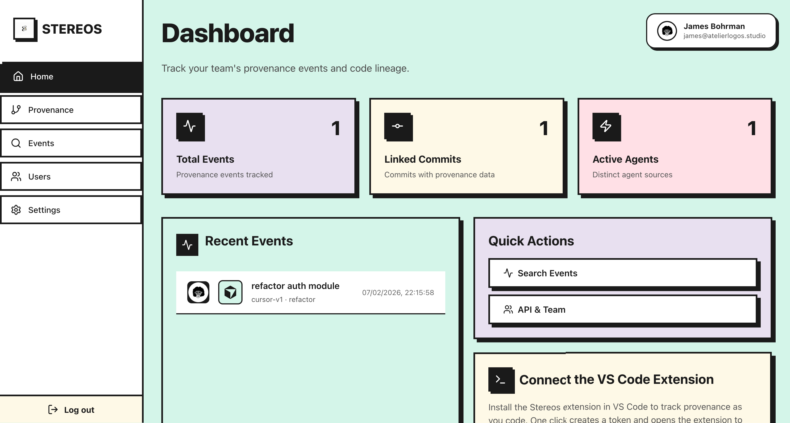
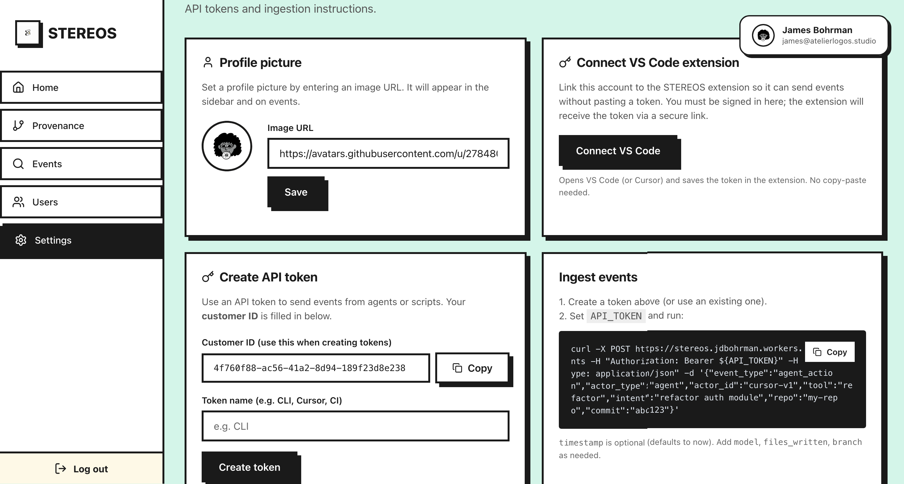
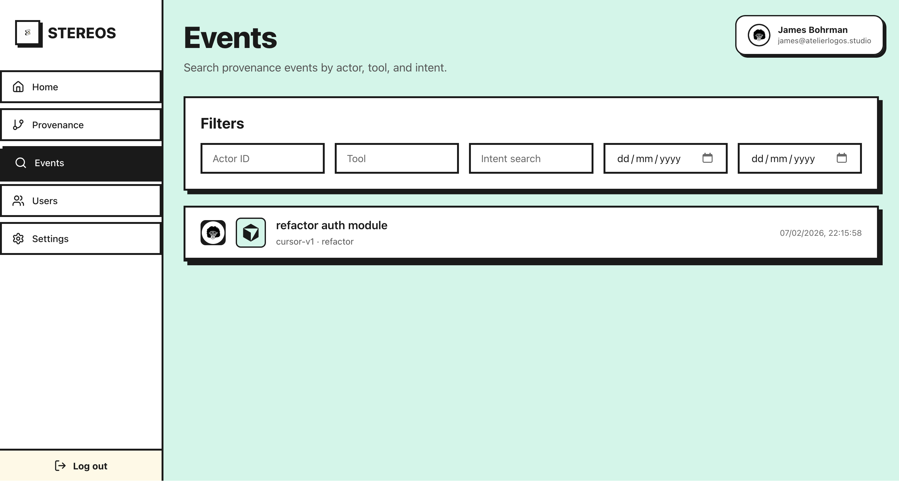
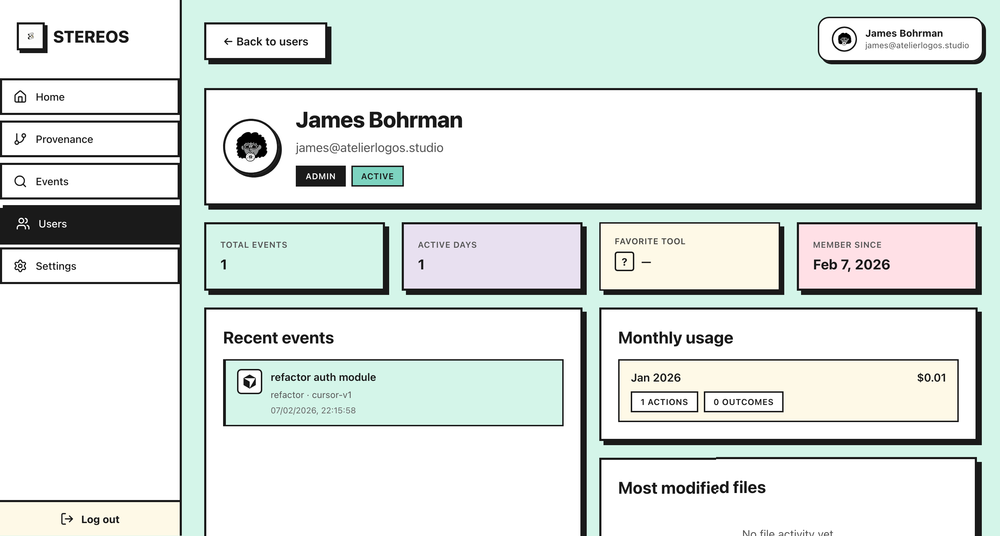

# STEREOS for VS Code

**Track AI-generated code provenance directly from VS Code and Cursor.**

STEREOS records every AI-assisted edit — which tool made the change, what model was used, which files were touched, and why — so your team has a complete audit trail of AI contributions to your codebase.

---

## Quick Start

### 1. Install the Extension

Search for **Stereos** in the VS Code / Cursor extension marketplace and click **Install**.

### 2. Connect Your Account

1. Open the command palette (`Cmd+Shift+P` / `Ctrl+Shift+P`) and run **STEREOS: Connect Account** — this opens the STEREOS dashboard in your browser.
2. Sign in (or create an account) on the dashboard.
3. On the **Settings** page, click **Connect VS Code**. The extension receives your token automatically via a secure deep link — no copy-paste needed.

> **Fallback:** You can also run **STEREOS: Configure API Token** from the command palette to paste a token manually, or set `stereos.apiToken` in VS Code settings.

### 3. Start Coding

That's it. STEREOS begins tracking automatically. Every time an AI tool edits your code, a provenance event is recorded with full context.

---

## How It Works

| Method | Description |
|---|---|
| **Language Model Tool** (recommended) | In agent chat, the model calls `#recordProvenance` after making edits. You get accurate, edit-level attribution with a summary of what changed. Requires VS Code 1.85+ with Copilot agent mode or Cursor. |
| **Automatic File Tracking** | Watches for file creates, modifications, and deletes. Events are debounced (default: 5 seconds) and sent as a batch. The AI tool is inferred from your editor. |
| **Manual Tracking** | Right-click a file or run **STEREOS: Track Code Change** from the command palette to record a one-off event with full context. |

All methods automatically capture **git branch**, **commit hash**, **repo info**, and **session duration**.

---

## Supported AI Tools

STEREOS auto-detects the AI tool in use:

- Cursor (with model detection)
- GitHub Copilot
- Sourcegraph Cody
- Continue.dev
- Supermaven
- Codeium

---

## The Dashboard

### Provenance Overview

See total events, linked commits, and active agents at a glance. Recent events appear on the home page with quick links to search or manage your team.

### Event Search

Filter provenance events by actor, tool, intent, and date range to find exactly what you're looking for.

### User Profiles

View per-user activity including total events, active days, favorite tools, monthly usage, and most modified files.

---

## Commands

| Command | Description |
|---|---|
| **STEREOS: Connect Account** | Open dashboard to link your account via deep link |
| **STEREOS: Track Code Change** | Manually record a provenance event with detailed context |
| **STEREOS: View Provenance** | Open the dashboard in an embedded webview |
| **STEREOS: Open Dashboard** | Open the dashboard in your browser |
| **STEREOS: Open Event in Dashboard** | Jump to a specific event by ID |
| **STEREOS: Flush Pending Changes** | Immediately send any buffered events |
| **STEREOS: Toggle Auto-Tracking** | Enable or disable automatic file tracking |
| **STEREOS: Configure API Token** | Manually set your API token |

---

## Settings

| Setting | Default | Description |
|---|---|---|
| `stereos.apiToken` | — | Your API token (set automatically via Connect Account) |
| `stereos.autoTrack` | `true` | Enable automatic file-change tracking |
| `stereos.debounceMs` | `5000` | Milliseconds to wait before batching file events |
| `stereos.actorId` | `vscode` | Identifier for the actor in provenance events |

---

## API & CI/CD Integration

STEREOS isn't limited to VS Code. You can send provenance events from any agent, script, or CI pipeline using the REST API. Create an API token on the **Settings** page of the dashboard, then POST events directly.

See the [API documentation](https://stereos.dev/docs) for details.
